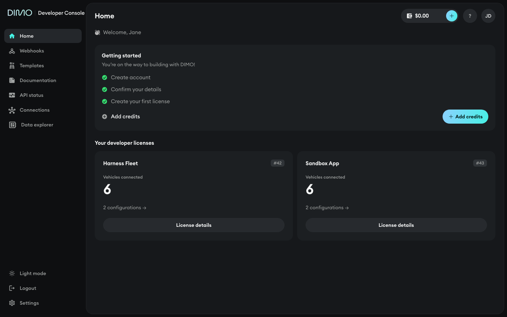
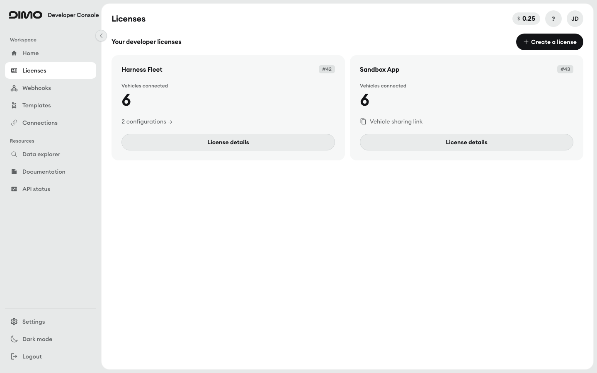

# DIMO Developer Console — visual design system

The console shares its visual language with DIMO Fleet and the DIMO Driver app:
Euclid Circular A, cool blue-black surfaces, the sky→mint DIMO gradient, and
generous radii, in dark and light. Tokens live in `src/app/globals.css` and are
exposed as Tailwind classes by `tailwind.config.ts`; this doc is how to use
them.




## Principles

1. **Mint means live or actionable.** `bg-brand-gradient` and `text-accent-ink`
   are reserved for primary actions, the selected/active state
   (`bg-selected`), and "on"/live status (`bg-accent` dots, `Toggle`). It never
   decorates. If everything is mint, nothing is.
2. **Ink, not white; `fg`, not white.** `text-ink` is the high-emphasis text
   color (titles, key values, metrics) — it is not a button fill. `text-fg` is
   body text. Primary buttons use `bg-brand-gradient`, never a white or ink
   fill.
3. **Sentence case, one typeface.** Labels are `text-label` (12px/500),
   sentence case, no letter-spacing. No uppercase or tracked mono "terminal"
   labels. Identifiers (VIN, token id, plate, counts) stay in Euclid — tabular
   figures are on globally (`font-feature-settings: 'tnum'`), so digits still
   align without `font-mono`.
4. **Surfaces separate by tone, not lines.** Prefer a tonal step
   (`bg-card` → `bg-control` → `bg-highest`) or whitespace over a 1px border.
   Keep `border-outline` for inputs, table row dividers and the few places a
   hairline carries meaning.
5. **Radius follows hierarchy.** `rounded-chip` (6px) for badges and menu
   items · `rounded-control` (10px) for inputs, buttons-in-rows and dropdown
   menus (`SelectField` `.custom-menu`, `DatePicker`) · `rounded-card` (16px)
   for cards and toasts · `rounded-panel` (20px) for modals, the guest card
   and the app shell · `rounded-full` for pills and primary buttons.
6. **Status color marks, it doesn't write.** `positive` / `warning` /
   `negative` color the 6px dot or the icon; the words beside them are
   `text-fg` or `text-muted`. See "Status color" below.

## Tokens

All values are RGB channels in `globals.css` so Tailwind opacity modifiers
work (`bg-card/60`); every token is defined for both themes
(`tokens.test.ts` fails otherwise).

| Role                                            | Tailwind class                  | Dark                           | Light                   |
| ----------------------------------------------- | ------------------------------- | ------------------------------ | ----------------------- |
| App canvas (behind sheet, sidebar)              | `bg-canvas`                     | `#0E0F11`                      | `#E7E9E9`               |
| App shell / page background                     | `bg-sheet`                      | `#16181B`                      | `#FFFFFF`               |
| Card                                            | `bg-card`                       | `#1C1F22`                      | `#F6F7F7`               |
| Control fill, input, hover step                 | `bg-control`                    | `#272A2E`                      | `#E9EBEB`               |
| Elevated hover step (skeletons, hover-on-hover) | `bg-highest`                    | `#303438`                      | `#DFE2E2`               |
| Brightest surface (active segmented tab)        | `bg-bright`                     | `#3A3E42`                      | `#FFFFFF`               |
| Overlay (modal panel, dropdown menu, toast)     | `bg-overlay`                    | `#1C1F22`                      | `#FFFFFF`               |
| Hairline                                        | `border-outline`                | `#2A2E32`                      | `#E1E4E4`               |
| Stronger hairline                               | `border-outline-strong`         | `#5C6063`                      | `#A0A3A2`               |
| App shell border                                | `border-sheet-border`           | `rgba(255,255,255,.06)`        | `rgba(19,20,23,.06)`    |
| Title / high-emphasis text                      | `text-ink`                      | `#F6F7F7`                      | `#131417`               |
| Body text                                       | `text-fg`                       | `#EDEEEE`                      | `#131417`               |
| Secondary / meta text                           | `text-muted`                    | `#A0A3A2`                      | `#5E6163`               |
| Accent fill                                     | `bg-accent` / `text-accent`     | `#46F1E4`                      | `#22C7BA`               |
| Accent as text/icon                             | `text-accent-ink`               | `#46F1E4`                      | `#0B7A72`               |
| Text on an accent fill                          | `text-on-accent`                | `#06201E`                      | `#06201E`               |
| Accent tint (soft, non-text-bearing hovers)     | `bg-accent-soft`                | mint 12%                       | mint 14%                |
| Accent tint, strong (rare; not selection)       | `bg-accent-soft-strong`         | mint 28%                       | mint 30%                |
| **Selected / toggled fill**                     | `bg-selected`                   | mint 28% (`#46F1E4`)           | mint 14% (`#46F1E4`)    |
| Sky (gradient's second stop; decorative only)   | `text-sky` / `bg-sky`           | `#8CD0FF`                      | `#2B82D5`               |
| Positive / success                              | `text-positive` / `bg-positive` | `#36DF71`                      | `#1B8842`               |
| Warning                                         | `text-warning` / `bg-warning`   | `#FFAC60`                      | `#B75B0A`               |
| Negative / error                                | `text-negative` / `bg-negative` | `#FF6060`                      | `#C70000`               |
| Negative, soft background                       | `bg-negative-soft`              | `#402321`                      | `#FFF0F0`               |
| Favorite                                        | `text-favorite` / `bg-favorite` | `#FFCD29`                      | `#C99A00`               |
| Nav hover                                       | `bg-nav-hover`                  | `#16181B`                      | `rgba(255,255,255,.55)` |
| Nav active                                      | `bg-nav-active`                 | `#24272B`                      | `#FFFFFF`               |
| Scrim (modal backdrop)                          | `bg-scrim`                      | `rgba(8,9,10,.62)`             | `rgba(19,20,23,.32)`    |
| Primary button / accent fill                    | `bg-brand-gradient`             | sky `#8CD0FF` → mint `#46F1E4` | same                    |

`selected` is its own token, not `accent-soft-strong`: at 30% light-mode
tint, `accent-ink` text drops below AA, so `selected` uses a 14% tint in
light (28% in dark) tuned so `accent-ink` on it stays AA over `sheet`,
`card` and `overlay`. Never use `bg-accent-soft-strong text-accent-ink` for a
selected/checked state — use `bg-selected text-accent-ink`.

## Type scale

| Class              | Spec                         | Used for                                                                                                                                        |
| ------------------ | ---------------------------- | ----------------------------------------------------------------------------------------------------------------------------------------------- |
| `text-title`       | 600 20/28, `-0.01em`         | Page header title (`Header .page-title`); `<Title>`'s default className                                                                         |
| `text-panel-title` | 600 17/24                    | Modal / panel headers, e.g. `<Title className="text-panel-title">` in `CreateAppModal`, `DeleteConfirmationModal`, the vehicle simulator header |
| `text-card-title`  | 600 15/22                    | Card and section titles: license card name, "Your developer licenses", "Getting started", the credits large-variant label                       |
| `text-metric`      | 600 40/44, `-0.03em`         | Big numbers: DCX balance, vehicle count                                                                                                         |
| `text-body`        | 400 15/22                    | Default paragraph copy: banner subtitles, onboarding rows                                                                                       |
| `text-body-sm`     | 400 14/20                    | Dense UI text: button labels, table cells, form inputs, card copy                                                                               |
| `text-label`       | 500 12/16                    | Table headers, chips/badges, meta captions, step labels                                                                                         |
| `text-code`        | 400 13/20 (with `font-mono`) | Monospace only — keys, ids, JWTs, code                                                                                                          |

`<Title>`'s own class (`.title` in `Title.css`) carries no size —
`font-semibold text-ink` only. Size always comes from the type-scale class
you pass in `className` (default `text-title`); see the `<Title>` pattern
below.

## Patterns

Every recipe below is copied from the restyled source, not paraphrased —
file paths are noted so a pass can diff its own work against them.

**`<Title>` component** (`src/components/Title/Title.tsx`,
`Title.css`): `.title` = `font-semibold text-ink` and nothing else — it
carries no size. Size always comes from `className` (default `text-title`
if none is passed): pass a type-scale class such as `text-panel-title` or
`text-card-title` to size it for the context. Never pass a raw size utility
(`text-2xl`, `text-3xl`, `text-4xl`) — those aren't tokens and won't track
the type scale.

**Page header** (`src/components/Header/Header.css`): `.header` = `flex
h-[72px] w-full min-w-0 items-center justify-between gap-2`; no border, sits
on the transparent `.app-content` sheet. Title: `.page-title` = `min-w-0
truncate text-title text-ink` (truncates so it never pushes widgets off at
390px). Right side: `.user-information` = `flex flex-shrink-0 flex-row
items-center gap-2 md:gap-3`. `Header.css` also carries a header-scoped
override, `.header .credits, .header .credits .credits-info { max-md:min-w-0
}`, so `CreditsWidget`'s own min-widths don't blow out the header on a phone.

**Sidebar** (`src/layouts/AuthorizedLayout/AuthorizedLayout.css`,
`src/components/Menu/Menu.css`): container `.sidebar-container` is
`md:w-[244px]` fixed, hidden below `md`. Inside, `.main-menu` = `flex h-full
w-full flex-col justify-between px-3 py-5`; brand row `.menu-brand` = `mb-7
flex flex-row items-center justify-between`; nav list `ul` = `flex flex-col
gap-0.5`. Brand lockup (`BrandLockup.css`): `flex h-8 items-center gap-2
px-2.5`, wordmark image + `.product` = `border-l border-outline pl-2
text-[15px] font-medium leading-none text-fg` (`-0.01em`); the wordmark PNG is
drawn for dark and gets `filter: brightness(0) opacity(.88)` in light mode.

**Nav item** (`src/components/Menu/MenuItem/MenuItem.css`): `.menu-item` =
`flex h-10 flex-row items-center gap-3 rounded-control px-3 text-body-sm
font-medium text-muted transition-colors`; hover → `bg-nav-hover text-fg`;
active (`.is-active`) → `bg-nav-active text-ink` with its icon at
`text-accent-ink`; disabled → `pointer-events-none opacity-50`.

**Page intro** (`src/app/webhooks/webhooksPage/Header/Header.tsx`,
`src/app/templates/templatesPage/Header/Header.tsx`,
`src/app/connections/components/View/View.tsx`): a one-sentence description
of the page, directly under the page header, is `<p className="text-body-sm
text-muted">` — no rule under it, no heading element, no weight. A full
sentence is an intro, never a heading.

**Page section title** (`<PageSubtitle>`, `src/components/PageSubtitle`):
`text-title text-muted` `h2` over a `border-outline` rule. Only for a short
label that names a block of the page ("Organization settings" on /settings,
"Login with DIMO configurator" on the configurator pages). If it reads as a
sentence, use the page intro instead.

**Section title**: `text-card-title text-ink`, e.g. `LicenseList.css
.description .title` ("Your developer licenses") and `OnboardingBanner`'s
"Getting started"; an optional line under it is `text-body-sm text-muted`.

**Card** (`src/components/Card/Card.css`): base `.card` = `rounded-card
bg-card p-4`. `.card-border` adds `border border-outline`; `.secondary`
switches the fill to `bg-sheet` (a card that must sit on canvas rather than
the sheet). Clickable card (`LicenseCard.css`) adds `transition-colors
hover:bg-control`; a `variant="secondary"` `<Button>` inside that card steps
to `bg-highest` on card hover (`.license-card:hover .button.secondary {
bg-highest }`) so it keeps its edge instead of melting into the card.

**Metric**: `text-metric text-ink` for the big number (`CreditsWidget`'s
large variant, `LicenseCard`'s `.anchor.license-card-metric` = `w-fit py-0
text-metric text-ink` — it's a link, but stays ink, not mint), with a
`text-label text-muted` caption underneath.

**Status dot**: `inline-block size-1.5 flex-shrink-0 rounded-full` (6px),
colored by state. In a toast (`Toast.css` `.toast-status-dot`, plus `mt-1.5`)
`success` → `bg-positive`, `error` → `bg-negative`, `info` → `bg-accent`.

**Status chip** (`src/components/StatusChip/StatusChip.tsx`) — the one status
idiom for a record's state in a list or table: the status dot inside a
neutral chip, `inline-flex w-fit items-center gap-1.5 whitespace-nowrap
rounded-chip bg-control px-2 py-0.5 text-label text-fg`. Use `<StatusChip
tone=…>`; don't hand-roll it. Tones:

| `tone`    | Dot                                                    | Means                     | Used for                                                |
| --------- | ------------------------------------------------------ | ------------------------- | ------------------------------------------------------- |
| `live`    | `bg-accent shadow-[0_0_8px_var(--accent-soft-strong)]` | running right now         | webhook Enabled (`Webhooks/components/StatusBadge.tsx`) |
| `on`      | `bg-accent`                                            | done / in place           | invitation accepted, template exists                    |
| `pending` | `bg-warning`                                           | waiting on someone        | invitation sent / pending                               |
| `off`     | `bg-muted`                                             | off, or nothing there yet | webhook Disabled, "No template yet"                     |
| `error`   | `bg-negative`                                          | broken                    | webhook Failed, "Id cannot be a template"               |

The label is always `text-fg`. Never use `bg-selected` (that is selection,
not status) or a status-tinted chip. A bare count with a state (webhooks
"Errors") is the status dot + the number in `text-fg`, no chip.

**Status color** (enforced by `tokens.test.ts`): status colors are for dots
and icons. As _text_, light-mode `positive`/`warning` are only AA on `sheet`
and drop to 3.8–4.3:1 on `card`, `control` and status tints. So on any card,
control or tinted surface the meaning goes on a dot or icon
(`WarningAmberIcon` / `CheckIcon` / `CheckCircleIcon` in the status color,
≥ 3:1 non-text contrast on `card`, `control` and `overlay`) and the words are
`text-fg` (or `text-muted` for secondary detail). A status tint
(`bg-warning/10 border-warning/40`) takes `text-fg` title + `text-muted` body,
never the status color at reduced opacity. Examples: `EntitlementBanner`,
the brand-rename warning in `BrandForm`, the explorer's missing-JWT notice
and "Latest signals unavailable" panel, completed steps in
`FormStepTracker`, the vehicle simulator's "Removed on-chain" badge. The one
exception is error text (`text-negative`: form errors, `TextError`,
`role="alert"` lines), which the test holds at AA on `sheet`, `card`,
`control`, `overlay` and `negative-soft`.

**Chip / badge** (neutral metadata, not status — for status use the status
chip above): `rounded-chip ... text-label text-muted`, tone set by what
it sits on — on a card, step up to `bg-highest` (`LicenseCard.css`
`.license-card-token-id` = `shrink-0 rounded-chip bg-highest px-2 py-0.5
text-label text-muted`); on a control-toned surface, `bg-control`
(`VehicleSimulator.css` `.vehicle-sim-testnet-badge` = `self-start
rounded-chip bg-control px-2 py-1 text-label text-muted`). Never uppercase or
tracked.

**Table** (`src/components/Table/Table.css`, `Column.css`, `Cell.css`):
outer wrapper = `rounded-card bg-card p-4` around `<table className="table">`.
Put `<Table>` straight into its section card (license details' Developer JWTs
and Signers, settings' Team management) — never inside a `Card.secondary`
or another card, which stacks three tonal levels. On a phone, hide a
low-priority column rather than scrolling the row's action off-screen
(settings hides Status below `md` and shows the status chip under the name).
Header row `.table-header` = `border-b border-outline`; header cell
`.custom-table-column` = `pb-3 text-left text-label text-muted` (no
background fill, sentence case). Body `.table-body` = `divide-y
divide-outline` (each `<tr>` also carries `border-t border-outline`). Cell
`.table-cell` = `h-[52px] max-w-[300px] break-all py-3 text-body-sm text-fg`.

**Pagination** (`src/components/Table/PaginatedTable.tsx`, `Table.css`, and
the explorer's `VehicleList.tsx`): the meta-and-controls row = `flex
items-center justify-between text-sm text-muted`. Round page buttons:
`<Button variant="secondary" className="table-page-button">` —
`variant="secondary"` supplies the border/fill/text/hover/disabled colors,
`.table-page-button` (`src/components/Button/Button.css` — it's a `Button`
size modifier, used outside tables too: `BrandRow`, `Signers`,
`DeveloperJwts`, `RedirectUriList`) only overrides size/shape (`flex !h-8
!min-h-0 !w-8 items-center justify-center rounded-full !px-0`) to make a
32×32 circle, so there is no double-styling.

**Buttons** (`src/components/Button/Button.css`, `Button.tsx`): base
`.button` = `inline-flex h-10 min-h-10 flex-row items-center justify-center
gap-2 rounded-full px-4 text-body-sm font-semibold transition-[filter,
background-color,color] duration-150 disabled:cursor-not-allowed
disabled:opacity-40`. `variant` (default `primary`):

| Variant             | Classes                                                                     | Use for                                                              |
| ------------------- | --------------------------------------------------------------------------- | -------------------------------------------------------------------- |
| `primary`           | `bg-brand-gradient text-on-accent enabled:hover:brightness-105`             | The one gradient action on a surface (Add credits, Create a license) |
| `secondary`         | `border border-outline bg-control text-ink enabled:hover:bg-highest`        | Cancel/auxiliary actions, secondary CTAs (License details)           |
| `ghost`             | `bg-transparent text-muted enabled:hover:bg-control enabled:hover:text-ink` | Low-emphasis inline actions                                          |
| `destructive`       | `bg-negative-soft text-negative enabled:hover:brightness-110`               | Destructive confirm inside a modal                                   |
| `destructive-ghost` | `bg-transparent text-negative enabled:hover:bg-negative-soft`               | Destructive inline/cancel-adjacent action                            |

Keep one `primary` per surface — never two gradient buttons in the same
row/card (e.g. `CreateAppButton` accepts a `variant` prop so it can be
demoted to `secondary` inside the onboarding banner).

**Selected / toggled state** (list/chip/card selection —
`VehicleSimulator.css` `.selected` on region/make/model/year pickers):
`bg-selected text-accent-ink`, `border-transparent`. Never a white slab,
never `bg-accent-soft-strong text-accent-ink`. This is distinct from the
segmented control below, which uses a neutral elevation instead of mint.

**Segmented control** (`src/components/SegmentedControl/SegmentedControl.css`):
track `.segmented-control` = `flex w-fit flex-row gap-0.5 rounded-full
bg-control p-[3px]`; each `.segment` = `flex cursor-pointer flex-col
rounded-full px-3.5 py-1.5 text-[13px] font-medium leading-[18px] text-muted
transition-colors hover:text-fg`; the active segment `.selected` = `bg-bright
text-ink shadow-sm` — a raised neutral step, not mint.

**Toggle** (`src/components/Toggle/Toggle.css`): track `.bar` (40×20 pill) —
`active` → `bg-accent`, `inactive` → `bg-highest`. Knob `.dot` (16px circle)
— `active` → `translate-x-5 bg-on-accent`, `inactive` → `translate-x-0
bg-ink`. Mint here means "on", matching the live/actionable principle.

**Text input + focus** (`src/components/TextField/TextField.css`):
`.text-field` = `flex min-h-10 flex-row items-center rounded-control border
border-outline bg-control px-3 text-fg transition-[border-color,box-shadow]
focus-within:border-accent focus-within:ring-[3px]
focus-within:ring-accent-soft`; inner `<input>` = `w-full bg-transparent
text-body-sm font-normal outline-0 placeholder:text-muted`. **This is the
only one of the two with a focus ring** — the ring lives on the container
(`focus-within`) so it fires when the real `<input>` inside it is focused.

**Select field** (`src/components/SelectField/SelectField.css`): this is a
click-to-open custom menu, not a text input, and has **no
focus-within/transition/ring** — do not copy the text-field's focus classes
onto it. Container `.select-field` = `relative flex min-h-10 flex-row
items-center justify-between rounded-control border border-outline
bg-control px-3 text-body-sm font-normal text-fg outline-0` (the real
`<select>` inside is `hidden`; the visible value is a `<p>`, styled
`text-fg` once a value is chosen). Its dropdown `.custom-menu` = `absolute
left-0 top-full z-10 mt-1 hidden max-h-48 w-full flex-col gap-0.5
overflow-y-auto rounded-control bg-overlay p-1 text-fg shadow-float`, shown
via a `.show` modifier (`flex`); each `.custom-item` = `cursor-pointer
rounded-chip px-2.5 py-2 hover:bg-control`.

**Modal** (`src/components/Modal/Modal.css`, `Modal.tsx`): backdrop = `bg-scrim
backdrop-blur-[6px]`. Panel `.dialog-panel` = `rounded-panel bg-overlay p-6
text-fg shadow-float` (a near-fullscreen inset sheet on mobile,
`min-h-[95vh]`; content-sized `md:min-w-[480px] md:max-w-[560px]` on
desktop). Close button `.close-btn` = `rounded-full p-1 text-muted
hover:bg-control hover:text-ink` + the icon-button focus ring below. Actions
row `.dialog-action-content` = `mt-6 flex flex-col-reverse gap-2 sm:flex-row
sm:justify-end`. Panel title uses `<Title className="text-panel-title"
component="h3">` (see `CreateAppModal`).

**Toast** (`src/components/Toast/Toast.css`): `.toast` = `rounded-card
bg-overlay text-fg shadow-float`; status dot as above; title `.toast-title`
= `text-body-sm font-medium text-ink`; description `.toast-description` =
`text-body-sm text-muted`; close button `.toast-close-btn` = `inline-flex
rounded-full p-1 text-muted hover:bg-control hover:text-ink` + the icon-button
focus ring below.

**Icon-button focus ring** (`Toast.css` `.toast-close-btn`, `Modal.css`
`.close-btn`): `focus-visible:outline-none focus-visible:ring-2
focus-visible:ring-accent-ink focus-visible:ring-offset-2
focus-visible:ring-offset-{surface}`, where `{surface}` is the token the
button sits on (`overlay` for toasts and modals; `ring-offset-*` takes any
color token). `accent-ink` holds ≥ 3:1 against every surface; `accent-soft`
does not, so never use it as a focus ring on its own. Buttons, nav links and
`ThemeToggle` keep the browser's focus ring — don't strip it without adding
this one.

**Empty state** (`src/app/app/list/components/EmptyList/index.tsx`): `flex
w-full flex-1 flex-col items-center justify-center rounded-card bg-card p-10
text-center`; heading `text-card-title text-ink`; body `mb-5 mt-1
text-body-sm text-muted`; a single primary `<CreateAppButton>` beneath.

**Onboarding / banner row** (`src/components/OnboardingBanner/*.css`,
`*.tsx`): shell `.banner-content` = `flex w-full flex-col items-start gap-4
rounded-card bg-card p-5`; heading `text-card-title text-ink` + subtitle
`text-body-sm text-muted`. Completed row (`ActionCompletedRow`) =
`CheckCircleIcon` `size-4 text-positive` + `text-body text-muted`. Pending
row (`CTARow`) = `PlusCircleIcon` `size-4 text-muted` + title `text-body
font-medium text-ink` (+ optional `text-body-sm text-muted` subtitle), with
its CTA button on the right.

**Monospace rule**: `font-mono text-code`, only for API keys, client ids,
JWTs, keys, CEL expressions, payloads and code views —
`src/components/CopyableRow/CopyableRow.css` = `rounded-control bg-control
px-3 py-2 font-mono text-code text-fg`. Token ids, VINs and counts stay in
Euclid (see Principle 3); do not add `font-mono` to them.

## Theming

`RootLayout` sets `<html data-theme="dark" suppressHydrationWarning>` and
inlines `THEME_INIT_SCRIPT` (`src/utils/theme.ts`) in `<head>`, which reads
`localStorage['dimo-theme']` and sets `document.documentElement.dataset.theme`
before first paint — a light page never flashes dark. Storage key:
`dimo-theme`; default `dark`; value is `light` or absent (never writes the
string `"dark"`).

`useTheme()` (`src/context/ThemeContext.tsx`) exposes `{ theme, setTheme,
toggleTheme }`; on mount it syncs its state from `readStoredTheme()` since
the pre-paint script already applied the theme to the DOM. `ThemeToggle`
(`variant="menu" | "icon"`) calls `toggleTheme()`; its label is the mode
you'd switch _to_ ("Light mode" in dark, "Dark mode" in light).

Every CSS variable in `globals.css` must exist under both
`:root[data-theme='dark']` and `:root[data-theme='light']` —
`__tests__/unit/utils/tokens.test.ts` fails otherwise. The same suite checks
WCAG AA for `fg`/`ink`/`muted`/`accent-ink` over their surfaces, status text
on `sheet`, `negative` error text on `card`/`control`/`overlay`, `fg`/`muted`
on each `status/10` tint over `card`, 3:1 non-text contrast for the status
colors (dots and icons) on `card`/`control`/`overlay`, and `accent-ink` on the
`selected` tint over `sheet`, `card` and `overlay`.

## Don'ts

- No hex colors in components — only in `src/app/globals.css`,
  `GoogleIcon.tsx` (the one multi-color brand logo `check-tokens.sh`
  excludes by name), and stored data values marked `// token-check:allow`.
  `GitHubIcon.tsx` is not exempt and doesn't need to be — it already paints
  with `fill="currentColor"`, no hex literals. Checked by `npm run
visual:check`.
- No `uppercase`, no positive tracking (`tracking-wide*`,
  `tracking-[0.1em+]`); negative tracking comes only from the type scale.
  `font-mono` only on keys/ids/code (`text-code`), never on labels, badges,
  dates, counts or token ids.
- `npm run visual:check` (`scripts/visual/check-tokens.sh`) also flags every
  default Tailwind color ramp (`gray`, `slate`, `zinc`, `neutral`, `stone`,
  `blue`, `indigo`, `green`, `amber`, and the rest), not just the ones named
  in the class map below — if a class isn't a token class, assume it will
  fail the check.
- No white/black slabs: no `text-white`, `bg-white`, `bg-black`,
  `bg-black/50` (see `class-map.md` for replacements).
- Selected/toggled state is never a white slab and never
  `bg-accent-soft-strong text-accent-ink` — always `bg-selected
text-accent-ink`.
- Don't use mint (`accent`, `accent-ink`, `bg-brand-gradient`, `bg-selected`)
  for decoration — only primary actions, selected/active state, and
  live/online status.
- Don't stack two `variant="primary"` buttons on one surface.
- Don't write status in color on a card or tint (`text-positive`,
  `text-warning`, `text-warning/70` …): dot or icon in the status color, words
  in `text-fg`/`text-muted`. Only `text-negative` error text is exempt.
- Don't use `bg-selected` for status — it means "selected".
- Icons paint with `currentColor` (`fill="currentColor"`, or inherit from an
  SVG library that already does); color them with a text class. `GoogleIcon`
  is the one exception — it keeps its fixed brand colors.

## Checking your work

```
npm run visual:dev                                    # start/attach the harness
npm run visual:shoot -- --label=<name> --only=<regex>  # screenshot routes, dark+light, desktop+mobile
npm run visual:check -- <paths…>                       # fail on legacy colors/hex/uppercase/tracking/legacy variants
```

Routes live in `scripts/visual/routes.mjs`. A route whose entry sets
`knownHydrationError` carries a pre-existing hydration race (present on the
untouched baseline, unrelated to styling: the `useUser` SSR/CSR race on the
`/app` and `/settings` pages and their modals) that the harness logs instead
of failing the shot. `routes.mjs` is the source of truth; at the time of
writing it flags eight: `app`, `app-create-modal`, `app-empty`,
`app-mobile-menu`, `app-add-credits-modal`, `app-account-info-modal`,
`settings` and `settings-support-modal`; a hydration error on any
other route is real and fails the shot — that one is yours to fix.
**`app-empty`** is also the `/app` route with `noLicenses: true`, i.e. the
zero-license empty state (`EmptyList`) — shoot it whenever a pattern you're
touching appears there.

What "logs instead of failing" means, precisely (`shoot.mjs`): a console
error matching the hydration/dev-overlay pattern is only ever printed to the
shoot's own console output, as `known (<reason>): <message>`, for a route
with `knownHydrationError` — it is never written to `errors.json`. Only an
uncaught page exception (`page.on('pageerror')`) is written to
`errors.json`, and `knownHydrationError` does not suppress those. Each
`--label=<name>` run writes PNGs and one
`scripts/visual/out/<name>/errors.json` (every uncaught page exception from
that run, keyed by route/theme/viewport) — read both the console output (for
known-hydration lines) and `errors.json` (for real exceptions), don't just
check exit codes.

To see a state that isn't already a route (e.g. a modal open, a menu
expanded, a form filled), add an entry to `ROUTES` in `routes.mjs`. Fields:
`name` (label for the PNG filename), `path`, `ready` (text to wait for
before shooting), `click` (selector, or array of selectors, to click after
load — e.g. to open a modal or menu), `fill` (`{selector: value}` map, filled
before any `click`), `after` (text to wait for once `click`/`fill` are done),
`viewports` (restrict to `['desktop']` or `['mobile']`), `guest` (skip the
authenticated-session cookies/storage for signed-out routes), `noLicenses`
(mock identity with zero developer licenses), and `knownHydrationError`
(only for a pre-existing race, with a one-line reason as the value — don't
add this to silence a hydration error your own change introduced).

## Legacy → token class map

Every restyle pass applies this map to the files it owns. `selected` state
uses the `bg-selected` token (a ruling that supersedes older guidance to use
`bg-accent-soft-strong`).

| Legacy                                                                                                                                   | Replace with                                                                              |
| ---------------------------------------------------------------------------------------------------------------------------------------- | ----------------------------------------------------------------------------------------- |
| `text-white`                                                                                                                             | `text-ink` for titles, values and emphasis; `text-fg` for body text                       |
| `text-black` (on white buttons/selected)                                                                                                 | handled by `Button` `variant` or `text-accent-ink` on selected                            |
| `bg-white` as button / selected fill                                                                                                     | `Button` `variant="primary"`; selected = `bg-selected text-accent-ink`                    |
| `bg-black`                                                                                                                               | `bg-canvas`                                                                               |
| `bg-black/50`, `bg-black bg-opacity-50`, `bg-black/60`                                                                                   | `bg-scrim`                                                                                |
| `text-text-secondary`, `text-grey-200…500`, `text-gray-400/500`, `text-white/50`, `text-[#BABABA]`, `text-neutral-500`, `text-[#6B6E6E]` | `text-muted`                                                                              |
| `text-grey-50/100`, `text-gray-900`                                                                                                      | `text-fg`                                                                                 |
| `bg-surface-default` inside the page                                                                                                     | `bg-card` (a panel on the sheet)                                                          |
| `bg-surface-raised`, `bg-[#201C1E]`                                                                                                      | `bg-card`                                                                                 |
| `bg-surface-sunken`, `bg-[#0A0508]`, `bg-[#141012]`                                                                                      | `bg-sheet` when it is a well inside a card; `bg-canvas` when it is behind everything      |
| `bg-cta-default`, `bg-[#322D2F]`, `bg-dark-grey-950`, `bg-dark-grey-800`                                                                 | `bg-control`                                                                              |
| `border-[#322D2F]`, `border-cta-default`, `border-t-cta-default`, `border-grey-950`, `border-surface-raised`, `divide-dark-grey-950`     | `border-outline` / `border-t-outline` / `divide-outline`                                  |
| `hover:border-white`, `hover:bg-gray-50`                                                                                                 | `hover:bg-highest` (tonal step, not a bright border)                                      |
| `bg-red-900` as highlight / selected                                                                                                     | `bg-selected text-accent-ink` (not `bg-accent-soft-strong`)                               |
| `hover:bg-red-900`                                                                                                                       | `hover:bg-control`                                                                        |
| `text-red-400/500`, `text-feedback-error`, `ring-red-500`                                                                                | `text-negative` / `ring-negative`                                                         |
| `bg-feedback-error`                                                                                                                      | `bg-negative-soft text-negative`                                                          |
| `bg-feedback-success`, `text-green-400`                                                                                                  | `bg-positive` / `text-positive`                                                           |
| `text-primary-200/300`, `bg-primary-300`, `bg-primary-200/20`                                                                            | `text-accent-ink` / `bg-accent` / `bg-highest` (skeletons)                                |
| `text-amber-500`, `border-amber-800/60`, `bg-amber-950/20`                                                                               | `text-warning`, `border-warning/40`, `bg-warning/10`                                      |
| `bg-[#124BDB]`, `bg-[#243647]`                                                                                                           | `bg-control`                                                                              |
| `fill-white`, `stroke-white`, `fill-grey-200`, `fill-white/50`                                                                           | `fill-current` / `stroke-current` plus a text color class (`text-muted`, `text-ink`)      |
| `font-black`                                                                                                                             | `font-semibold`, or the type-scale class the element is (`text-title`, `text-card-title`) |
| `text-2xl`/`text-3xl` page or section headings                                                                                           | `text-title`                                                                              |
| `text-lg`/`text-base` + bold card titles                                                                                                 | `text-card-title`                                                                         |
| `text-xs` meta, captions, table headers                                                                                                  | `text-label`                                                                              |
| `uppercase`, `tracking-wide*`, `tracking-[0.1em+]`, `capitalize` on headers                                                              | remove                                                                                    |
| `font-mono` on labels, badges, dates, counts, token ids                                                                                  | remove (keep only on keys/code, as `font-mono text-code`)                                 |
| `rounded-lg`/`rounded-md` on controls                                                                                                    | `rounded-control`                                                                         |
| `rounded-xl`/`rounded-2xl` on cards and panels                                                                                           | `rounded-card`                                                                            |
| modal / floating panel radius                                                                                                            | `rounded-panel` for modals; `rounded-control` for dropdown menus                          |
| small badges `rounded`                                                                                                                   | `rounded-chip`                                                                            |
| `shadow`, `shadow-lg`, `shadow-xl`                                                                                                       | `shadow-float` for floating things; none for cards                                        |
| focus `ring-indigo-500`, focus borders `border-white`                                                                                    | inputs: the text-input `focus-within` recipe; icon buttons: the icon-button focus ring    |
